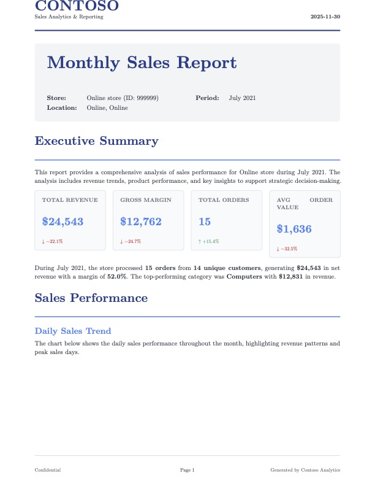
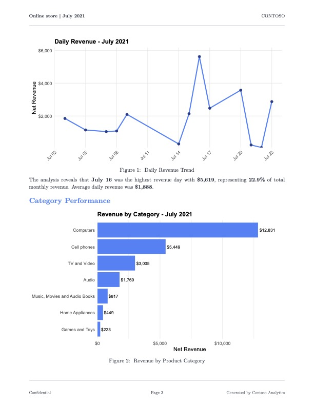
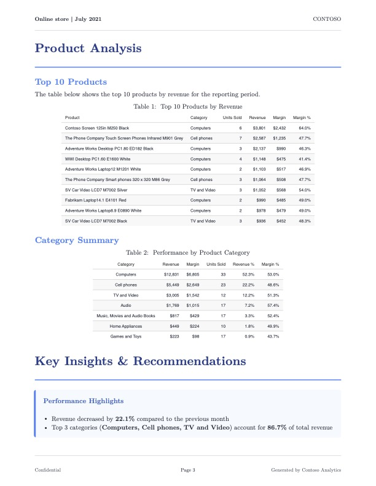
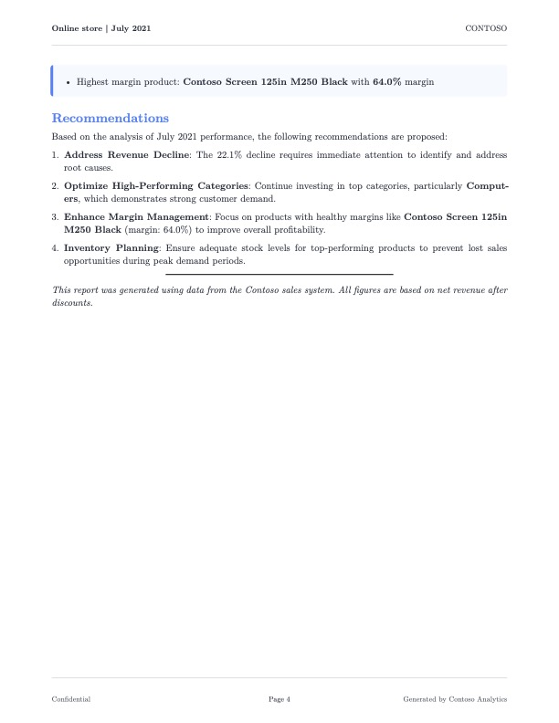

{fig-align="center"}

## Introduction

Recently at work we've had to build out a reporting solution for therapists that summarizes important patient treatment information in a nice looking PDF. If you've ever tried building a feature like this before, you know how painful generating PDFs can be. While researching technologies to use for this, I came across the term "burst reporting" to describe our use case. I never heard the term "burst reporting" before, and it got me thinking, how hard would it be to create a burst reporting app with R? And so this post was born. First, we're going to cover creating and styling the PDF using Quarto and Typst; then, we're going to create an R script that implements the burst reporting functionality. If you want to follow along, a full working example can be found at the GitHub repo [here](https://github.com/joekirincic/burst-reporting).

## Prerequisites

This post assumes intermediate knowledge of Quarto and Typst. We'll detail some aspects of Typst, and of integrating Typst with Quarto, I learned while preparing this post, but you won't find a full treatment of Typst and Quarto here. We're also going to show how we can improve the performance of our app using parallelization via `{mirai}`, so the post also assumes some familiarity with the package and its use.

## Dataset

We're going to use data from a newer R package called [`{contoso}`](https://usrbinr.github.io/contoso/) by [Alejandro Hagan](https://bsky.app/profile/usrbinr.bsky.social) for our project. This package includes various tables related to a fictional company called Contoso, and we're going to create reports based on the `sales` dataset. This is a great package for testing reporting solutions because it has decent volume, high cardinality categorical dimensions, and is representative of the kinds of data folks will encounter in corporate settings. A glimpse of the `sales` table can be found below.

```{bash, eval=FALSE}
Rows: 3
Columns: 20
$ order_key     <dbl> 233000, 233100, 233100
$ line_number   <dbl> 0, 0, 1
$ order_date    <date> 2021-05-18, 2021-05-19, 2021-05-19
$ delivery_date <date> 2021-05-18, 2021-05-19, 2021-05-19
$ customer_key  <dbl> 1855811, 1345436, 1345436
$ store_key     <dbl> 585, 550, 550
$ product_key   <dbl> 1483, 499, 1512
$ quantity      <dbl> 2, 1, 3
$ unit_price    <dbl> 376.6, 148.5, 334.6
$ net_price     <dbl> 376.600, 130.680, 287.756
$ unit_cost     <dbl> 173.180, 75.705, 153.874
$ currency_code <chr> "USD", "USD", "USD"
$ exchange_rate <dbl> 1, 1, 1
$ gross_revenue <dbl> 753.2, 148.5, 1003.8
$ net_revenue   <dbl> 753.200, 130.680, 863.268
$ unit_discount <dbl> 0.000, 17.820, 46.844
$ discounts     <dbl> 0.000, 17.820, 140.532
$ cogs          <dbl> 346.360, 75.705, 461.622
$ margin        <dbl> 406.840, 54.975, 401.646
$ unit_margin   <dbl> 203.420, 54.975, 133.882
```

## What is burst reporting?

Burst reporting is very simple. The idea is that, instead of generating one report containing all of your data, you generate one report for each subset of your data. Consider the `store_key` field in the `sales` dataset. You could imagine the company issuing a monthly performance report to each store that informs them how they're doing. This is a textbook example of a burst reporting use case, and we'll use it as our guiding example for this post.

But before we get into the how, let's dwell on the why. Why should we care about burst reporting? One reason is that it's often a legal requirement that a report only contains information about the intended recipient. Other reasons are more practical. Sometimes the consumers of your reports will have their own branding guidelines that vary across segments they want enforced, and the automation burst reporting brings spares your data team the effort of crafting each report individually. Burst reporting can also reduce overhead on critical resources like databases because of more efficient querying patterns. It might not be a shiny new LLM, but burst reporting has value for just about any data team.

## What we're building

We're going to build an application that generates a PDF report of monthly sales for each store in the `sales` dataset. Below is an example of what one of the reports will look like.

::: {layout="[[1,1]]"}







:::

The report provides an executive summary of the contents, followed by a mixture of plots and tables that illustrate different points of focus for the Contoso company. The report ends with some recommendations for coming months based on the data presented. Funderful.

Our app is composed of three parts.

-   **A Typst template.** This template will contain styling rules and functions for creating things like KPI boxes that Typst doesn't provide by default.

-   **A Quarto document.** This document is the workhorse of the report generation, leveraging the Typst template for styling and the data for the target subset to produce a slick looking PDF.

-   **An R Script.** This script will implement the burst reporting functionality, and is best understood as the orchestration layer of the app.

## The Typst template

The file `sales-report-template.typ` contains three custom functions that are worth explaining. Some details are omitted for brevity, but again, you can find the full source code in the repo.

**The `sales-report` function**

```{bash, eval=FALSE}
#let sales-report(
  title: "Monthly Sales Report",
  store-name: "Store Name",
  store-id: "000",
  report-period: "Month YYYY",
  report-date: datetime.today().display(),
  country: "",
  state: "",
  body
) = {
  // Color palette as variables for consistency
  let primary-color = rgb("#1e3a8a")
  let secondary-color = rgb("#3b82f6")
  // ... additional colors ...

  set page(
    paper: "us-letter",
    margin: (top: 2.5cm, bottom: 2.5cm, left: 2cm, right: 2cm),
    header: context {
      // First page gets branded header; subsequent pages get minimal header
      if counter(page).get().first() == 1 {
        // ... logo, company name, date ...
      } else {
        // ... store name, period, page number ...
      }
    }
  )

  // Heading styles using show rules
  show heading.where(level: 1): it => block(
    width: 100%,
    above: 24pt,
    below: 16pt,
    {
      text(size: 20pt, weight: "bold", fill: primary-color, it.body)
      v(6pt)
      line(length: 100%, stroke: 1.5pt + secondary-color)
    }
  )

  body
}
```

This function is responsible for top-level styling details for the entire document. We're defining details like font, font color, appearance of headings, and so on. One thing worth noting is that Typst has a keyword [`context`](https://typst.app/docs/reference/context/). This keyword allows us to manipulate content based on its position within a document. One of the things I wanted the sales report to have is a special header on the first page, but a minimal header on subsequent pages. The `context` keyword in Typst lets us express these kinds of things easily. Another thing to note is that we don't fill in much content here. This is because the main body content is going to come from Quarto.

**The `info-box` and `kpi-box` functions**

These two functions create custom elements I wanted the sales report to have. The `info-box` function creates a dedicated container where I can call out important info about each store (trend info, top-performing categories, etc.). The `kpi-box` function gives me another special container where I can display information about store KPIs (see below).

```{bash, eval=FALSE}
#let kpi-box(title, value, change: none, color: rgb("#3b82f6")) = {
  box(
    width: 100%,
    fill: rgb("#f9fafb"),
    inset: 12pt,
    radius: 4pt,
    stroke: 1pt + rgb("#e5e7eb"),
    {
      text(size: 9pt, weight: "semibold", fill: rgb("#6b7280"), upper(title))
      v(4pt)
      text(size: 18pt, weight: "bold", fill: color, value)
      if change != none {
        v(2pt)
        text(
          size: 8pt,
          fill: if change > 0 { rgb("#059669") } else { rgb("#dc2626") },
          weight: "medium",
          if change > 0 { [↑ +#change%] } else { [↓ #change%] }
        )
      }
    }
  )
}
```

Notice how, instead of just providing the current value of the metric, the KPI box also shows things like the percent change since the last reporting period, and colors it differently based on whether the change is positive or negative. Writing functions like these really sold me on the power of Typst for crafting PDFs. I've loathed working with PDFs in the past, but Typst actually made the experience enjoyable.

## The Quarto document

In a lot of ways, this Quarto doc isn't anything special. We have some executable code chunks that generate figures and tables for display in the report using `{ggplot2}` and `{gt}`. We're using [Quarto parameters](https://quarto.org/docs/computations/parameters.html) to filter the `sales` dataset by `store_key`, `year`, and `month` so the rendered PDF only contains monthly data for a single store. What's atypical is the use of raw Typst blocks in the document for inserting and arranging things like the KPI boxes; moreover, I don't reference my Typst file anywhere in the YAML front matter. Instead, I use another raw Typst block to import my styling directives and helper functions. Why did I do this instead of packaging my Typst files as a [Quarto template](https://quarto.org/docs/extensions/starter-templates.html) like all the cool kids? There are a couple of reasons. One is that the purpose of this project is to create a burst reporting application, not a Quarto template. The solution works well without configuring things as a Quarto template, so the extra engineering isn't necessary. Another reason is that I wanted more fine-grained control over how elements like the KPI boxes are laid out in the document. If I was rendering this document into additional formats like HTML, then these raw Typst blocks wouldn't make sense; but since we're only targeting PDFs, we'll get the best results using Typst blocks.

I think it's really cool that you can embed R expressions in raw Typst blocks. Consider the example below.

```{bash, eval=FALSE}
#grid(
  columns: (1fr, 1fr, 1fr, 1fr),
  column-gutter: 12pt,
  kpi-box("Total Revenue", "`r dollar(current_metrics$total_revenue)`", change: `r round(revenue_change, 1)`),
  // ...
)
```

Going into this, I was sure it wouldn't work, and yet, it does! Hell yeah.

## The R script

We need a program that does the following. First, it takes the `sales` dataset and produces a `data.frame` containing all unique combinations of `store_key`, `year`, and `month`. Then, it iterates row-wise over this `data.frame`, calling a custom function `generate_report` that takes the values of the row as arguments and forwards them as parameters to the Quarto CLI to render the monthly sales report. In code, it'd look something like this.

```{r, eval=FALSE}
library(contoso)
library(tibble)
library(dplyr)

# ... Other preamble code ...

results <- store_months |>
  group_by(
    store_key,
    year,
    month
  ) |>
  group_map(
    \(x, y) {
      generate_report(
        store_key = y$store_key,
        year = y$year,
        month = y$month
      )
    }
  )

```

If you're wondering what the second argument `y` is in the anonymous function, it's a `tibble` containing one row and one column for each column passed to the `group_by` function. For more details on this, see the documentation for [`group_map`](https://dplyr.tidyverse.org/reference/group_map.html). Anyway, at this level, the mechanics are pretty clear. Once I got this working, I noticed it was kind of slow. If I consider months for which a store had a minimum of 10 sales, I get 34 store-month combinations, and the app took \~1.8 minutes to produce all of them (\~3.2 seconds per report). Not ideal. Fortunately, I was able to find a way to speed things up, and we'll cover that in the next section.

## Parallelizing the code using `{mirai}`

Generating reports over distinct subsets of a dataset is an example of what's called an [*embarrassingly parallel problem*](https://en.wikipedia.org/wiki/Embarrassingly_parallel). There's no overlap in these subsets whatsoever, so we don't have to worry about the processing of one report impacting the processing of another report. In this way, we can simultaneously generate as many reports as we have cores. This sort of problem is well suited for a package like `{mirai}`, which we can use to launch tasks in parallel. We'll try that now, and see where it lands us in terms of performance.

There's a problem we need to handle for this to work properly. Consider the following snippet from the `generate_report` function.

```{r, eval=FALSE}
# Report Generation Function ----
generate_report <- function(
  store_key,
  year,
  month,
  store_name
) {
  # Create unique temporary directory for this render to avoid conflicts
  temp_dir <- tempfile(
    pattern = sprintf("quarto_%06d_%04d%02d_", store_key, year, month)
  )
  dir.create(temp_dir, recursive = TRUE)

  tryCatch(
    {
      # Format output filename
      output_file <- sprintf("store_%06d_%04d-%02d.pdf", store_key, year, month)
      output_path <- file.path(OUTPUT_DIR, output_file)

      # Copy Quarto template to temp directory
      file.copy("sales-report.qmd", file.path(temp_dir, "sales-report.qmd"))

      # Copy Typst template if it exists
      if (file.exists("sales-report-template.typ")) {
        file.copy(
          "sales-report-template.typ",
          file.path(temp_dir, "sales-report-template.typ")
        )
      }

      withr::with_dir(
        temp_dir,
        {
          temp_output <- file.path(temp_dir, output_file)
          quarto_render(
            input = file.path(temp_dir, "sales-report.qmd"),
            output_file = output_file,
            output_format = "typst",
            execute_params = list(
              store_key = store_key,
              year = year,
              month = month
            ),
            quiet = TRUE
          )
        }
      )
      # ... Remaining code omitted for brevity 
```

If you just try to call `mirai({ # business logic here })`, most of the reports will fail to generate. This is because, when the background R sessions call `generate_report`, they will generate intermediate files with the same name to the same directory, causing files from one process to get clobbered by another, and so the clobbered report fails to compile. This sort of problem is know as a [*race condition*](https://en.wikipedia.org/wiki/Race_condition). To prevent this, we need our background R sessions to do their work inside of a working directory that's isolated from each other. So on each function invocation we create a temp folder, copy the files we need into it, set it as our working directory, and then render the PDF without worry of race conditions. Swell.

Having solved for that, we can compare the performance of the two implementations. The following table shows the median total execution time of the two implementations. Each application was run 20 times. For the parallel implementation, 6 workers were used.

| Application         | Median total execution time |
|---------------------|-----------------------------|
| Without parallelism | 108 seconds                 |
| With parallelism    | 24 seconds                  |

The parallelized version is \~4.5 times faster than the original! Awesome. By fully utilizing the available cores on our machine, we can drive the total execution time down considerably.

## Conclusion

As it turns out, we can build a decent burst reporting application using open-source tools. Typst, Quarto, and R work very well together, allowing us to create reports that are not only visually appealing but efficient to build. We were able to make some improvements, but this application is still pretty basic; there are plenty of opportunities for further enhancement. We could convert this from a script to a REST API using `{plumber2}` so PDFs could be requested by other web services on demand. We could process more documents even faster by making a Docker image for the application and using a service like AWS Batch to produce PDFs in bulk on a regular schedule. But as exciting as this might be to think about, there's a question of whether or not we should. Answering that question is beyond the scope of this post, so we won't get into that here, but my gut tells me it's worth considering. Maybe we'll vet this consideration in a future post.

If anyone has ever successfully used Quarto for reporting solutions, please let me know. I'd like to learn more about how you've made Quarto work at scale within your organization.