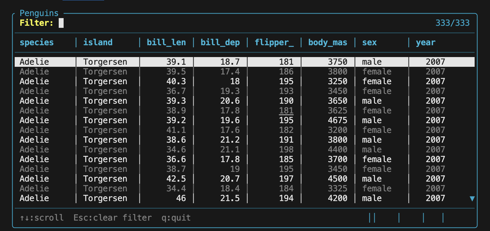

## Introduction

This post is about a new R package I’ve created called `{rtui}`. The package provides a framework for building text user interfaces, otherwise known as TUIs. TUIs are like web apps in that they have interactive interfaces, but instead of being web-based, they are terminal-based.

## An example TUI

Let's make things concrete. Consider the following example app that ships with the package.



You run `R -e rtui::run_example("table")` in a terminal to start the app. From there, you can interact with the app in much the same way you’d work with a Shiny app. You can scroll through the table rows using the arrow keys; you can click on a row to select it; you can filter the data displayed in the table using the filter input. You can do a lot of the same things with a TUI that you can do in a Shiny app. That said, you can make TUIs for dashboards, text editors, even games. The limit’s your imagination, really. If you’ve ever used Claude Code, you’ve used a TUI.

## Why TUIs?

I made the package for a few reasons.

-   I wanted to see if it was possible. There’s an awesome TUI framework called Textual that’s written in Python; if it’s possible to do it in Python, I wanted to see if I could do something similar in R.
-   I like working with TUIs.
    -   As someone who writes a lot of code, I dig the aesthetic of the terminal.
    -   Leaner stack. No web framework needed. Fewer dependencies make maintenance easier.
    -   Simpler to deploy. No need to spin up servers and whatnot.
    -   Less resource usage. Between a web app and a TUI, the latter is going to consume less memory and CPU.
    -   I already spend a lot of time in the terminal. TUIs provide a QOL improvement in a place I’m already dwelling in a lot.
    -   They can enhance CLI tools by providing an interactive interface to their public API. Web apps are great, but they can be overkill sometimes. Suppose you wanted an app to read through your Git history, or inspect AWS resources. In cases like this, you often just want a table you can filter and drill into for details. Do you really need to spin up a web server for that? I’d rather create a split terminal and run my CLIs in one window while my TUI runs in another. Some of this boils down to preference, but when it comes to internal developer tooling, CLIs and TUIs are a kickass pair.

## How do TUIs work?

TUIs work via dual buffers and an event loop. The dual buffers operate like the DOM in a web app. One buffer is what’s presented to the user in the terminal, and the second buffer contains all the changes resulting from interacting with the app. As interactions mutate the behind buffer, the event loop periodically determines what parts of the front buffer need to be re-rendered.

With all this diff-ing and state management, you might wonder about the package's performance. TUIs made with `{rtui}` are responsive and snappy. There’s two reasons for this. One is the use of dual buffers. Without dual buffers, we would need to redraw the whole UI every time the user interacted with the app. With dual buffers, we only update the parts of the app that changed, eliminating a lot of wasteful computation. Another reason is that `{rtui}` uses Rust under the hood for the computationally intensive parts; compiled code excels here. The R code wraps these lower level routines into a higher level, expressive API with sensible defaults that minimizes the effort spent thinking *how* to build something so you can focus on the what.

## A worked example

If you've made it this far, you're probably on the TUI train now and want to know how to make one with `{rtui}`. Below is the source code for a simple "Hello World" app. We'll walk through the code step by step, explaining key parts of the API along the way.

```{r, eval=FALSE}
library(rtui)

ui <- rt_border(
  rt_text("Hello from rtui!\n\nPress any key to exit.",
          fg = COLOR$GREEN, align = "center"),
  title = "Hello World",
  border_style = BORDER_ROUNDED
)

on_event <- function(event, state) {
  if (event$type == EVENT_KEY) rt_quit() else state
}

rt_run_app(rt_app(ui, on_event = on_event))
```

First, we create our UI. In `{rtui}`, we specify what the UI is upfront; in this way, it's similar to how `{shiny}` works. When the app starts, the app will walk the whole tree of widgets and render them to the screen. All exported functions in the package are prefixed with `rt_*`. The package has several enums for things like color (e.g. `COLOR`) we provide for styling elements of your app. Once we have a UI defined, we need to define a function `on_event` that tells your app how to respond to user events. This app listens for any key press event (`event$type == EVENT_KEY`), and when one occurs, the app exits. Once we have our UI and the logic for updating the app, we pass both to `rt_app`, which creates an `App` instance. You then pass that app instance to `rt_run_app` to start the app in your terminal.

## Conclusion

Go forth and take `{rtui}` for a spin and let me know what you think.