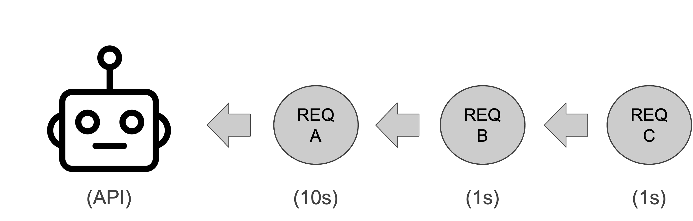
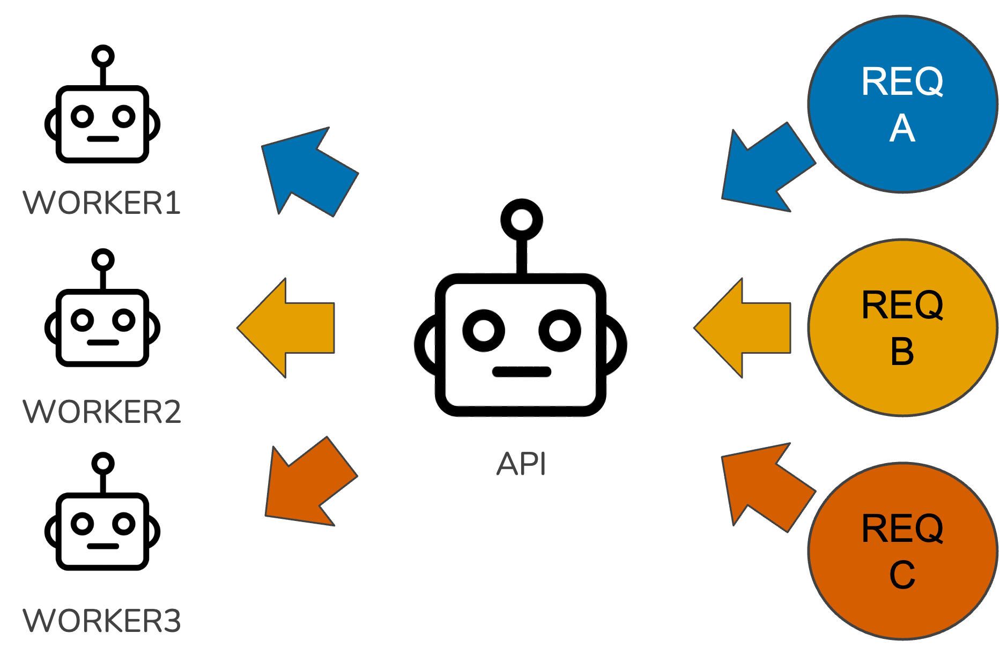

# Introduction

This is the second post in a series about performance optimization for Plumber APIs. In the last post, we covered [serialization](https://joekirincic.com/posts/performance-optimization-for-plumber-apis-serialization/); by tweaking object serialization code, we were able to cut processing time in half. This post focuses on improving the way our API handles concurrent requests using async programming.

# What is async programming, and why does it matter?

To understand what async programming is, we first need to remind ourselves of how R works at a low level. When you make an API with `{plumber2}`, that app uses a synchronous execution model by default. By synchronous execution model, I mean that it processes one instruction at a time, sequentially. This is because R is a single-threaded programming language, so there cannot be more than one line of code being evaluated at a time in the same program. This synchronous execution model isn't unique to R; all major programming languages operate this way by default. Many APIs work perfectly fine under this execution model, too, but in some circumstances, it can lead to disastrous performance. For example, imagine we have three incoming requests to our API, A, B, and C. Request A takes 10 seconds to complete, while Request B and Request C each take 1 second to complete. The following visual illustrates how these requests get processed.

{fig-align="center" width="596"}

Request A will take 10 seconds because it arrived first, but Request B will take 11 seconds because it has to wait for Request A to finish; and Request C will take 12 seconds because it has to wait for Request A and Request B to finish. If we imagine 3,000 incoming requests instead of 3, it's clear how things can get ugly. The slow requests create bottlenecks that cause a cascading backup of all downstream requests. Our API spends most of its time waiting, not working. Users experience increased latency, or even request timeouts. In circumstances like this, we need a new execution model. That model is the asynchronous execution model.

Asynchronous programming is basically executing multiple computations without waiting for each one to finish. It's computational multitasking. When Request A comes in, the API starts working on it, but when Request B and Request C come in, the API starts working on those requests, too. The end result is that Request A takes 10 seconds, and Request B and Request C each take only 1 second. Sounds great, but didn't we just say that R is single threaded? This isn't possible if we can only process one instruction at a time.

And yet, it is. The trick to pulling off async programming in `{plumber2}` is using background R sessions in addition to our main one. Consider the visual below.

{fig-align="center" width="512"}

Our main R session acts a relay, routing requests to workers and returning finished responses to the client, while the work our endpoints carry out happens inside these background R sessions. By default, `{plumber2}` uses the package [`{mirai}`](https://mirai.r-lib.org/) to coordinate these background R sessions. If you haven't heard of `{mirai}` before, go check it out. It's an amazing package for creating concurrent applications (and if you don't believe me, believe Posit: it's being used today by a lot of packages we all use, including `{shiny}`, `{purrr}`, and `{tidymodels}`).

# Creating async endpoints with `{plumber2}`

Okay, so we know we can pull off async programming in `{plumber2}`. How do we do it? This part's simple. Consider the code below.

```{r, eval=FALSE}

library(plumber2)

#* Get a response back asynchronously.
#* @get /greeting
#* @async
function(){
   "Ayyyyy SYNC!"
}
```

Jumping jackrabbits, we just add a tag! That's all we need to do to make our endpoint asynchronous with `{plumber2}`. For those familiar with the Python framework [`fastapi`](https://fastapi.tiangolo.com/async/), this should remind you of defining endpoint functions with `async def` to make them async. Contrast this with how you'd achieve an equivalent result using `{plumber}`.

```{r, eval=FALSE}

library(promises)
library(plumber)

#* Get a response back asynchronously.
#* @get /greeting
function(){
   mirai::mirai({
      "Ayyyyy SYNC!"
   }) %...>%
   (function(x) {
     x
    })
}
```

In the code above, we need to pass the business logic of our endpoint to the function `mirai`, which evaluates an R expression in a background R session and returns a `mirai` object. Then, you need to convert that `mirai` object into something called a *promise* using the promise pipe operator from the `{promises}` package. You then need to pass that promise to a function that returns the result when it's ready. For some of us, the last few sentences might make no sense, and that's fine. Async programming is confusing, and comes with a relatively steep learning curve at lower levels of detail. The good news is that, as we saw in the first example, `{plumber2}` abstracts away a lot of the confusing details so you can focus on your application code.

# Impact of async on API performance

So we know how to create async endpoints, but should we? What sort of performance gains can we expect from doing this? The impact of async programming for our application depends largely on what it does. If you look online for when to use async, you'll encounter this distinction between I/O-bound tasks and CPU-bound tasks. Async typically benefits apps with a lot of I/O-bound tasks.

What's an I/O-bound task? Think writing data to disk, querying databases, or more generally, whenever the API interacts with external services. The database example is the clearest for me. When our API issues a query to a database, it needs to wait for that DB to return the query results. During this time, our API's CPUs are idle. It would be great if our API was more proactive. Instead of doing nothing until the DB is done, maybe go handle another incoming request. This sort of multitasking is where async excels: it improves the performance of applications through more efficient CPU utilization. Assuming our app has lots of I/O-bound tasks, leveraging async with `{plumber2}` can make a big difference, depending on how many CPU cores we have. If we have four cores, then theoretically it's possible to process 4X as many requests using async[^1].

[^1]: In practice, it's probably going to be slightly less than that because of interactions between external systems, your OS's CPU scheduler, and other low level details beyond the scope of this post.

Contrast this with CPU-bound tasks, where async isn't as helpful. Examples of CPU-bound tasks include in-memory data processing, training machine learning models, or other complex mathematical calculations. These tasks keep our CPUs busy. If we have a server with 4 cores and training an ML model is using all of them, spawning more background R sessions isn't going to do much for us. Since all of the cores are busy, the R sessions will just idle about in the ether waiting for one of them to become available.

What if our API endpoints are a mix of I/O-bound and CPU-bound tasks? This is common with APIs for data science. For example, we might have an endpoint called `/train` that queries a large amount of data from a database and trains an XGBoost model on it. The I/O-bound part is getting data from the DB, and the CPU-bound part is training the XGBoost model. Do endpoints like this benefit from async programming? Probably, but with mixed cases it's best to use load tests to verify whether using async programming is beneficial.

# Limitations of async

Async programming can be powerful, but it has its limitations. The kind of async programming `{plumber2}` enables via the `{mirai}` package poses some issues for API developers, especially for data science applications. Remember that the concurrent processing is handled using processes instead of threads. For one, when errors occur, reasoning about why they occur becomes harder because our API no longer processes instructions sequentially. Sometimes the performance gain isn't worth the added complexity. Another issue is resource usage. We'll use memory as an example. When we spawn background workers with `{mirai}`, the workers don't share objects in memory; they each have to make their own copy of objects to carry out their task. Suppose our API provides sentiment analysis of social media posts using a deep learning model, and we make the `/sentiment` endpoint async. If our model takes up 0.5GB of RAM when loaded, and our API spins up 8 workers, each worker is going to load their own copy of the model. So before we've even done any work, our RAM usage jumps from 0.5GB to 4GB. In the worst case, this spike in memory could exceed the limits of our server, causing the API to crash. If our API doesn't crash on startup, it may hit an OOM error later due to the additional memory used to process all the incoming requests. Or some actions will spill over onto disk, slowing things down. Before making an endpoint asynchronous, be sure to evaluate the impact on the API's resources so it doesn't blow up.

# A checklist for making an endpoint async

If you want to get started with async programming, the following checklist can help you decide whether or not making an async endpoint is worth it.

-   \[\] Does the endpoint receive a lot of traffic compared to others?

-   \[\] Is the endpoint primarily I/O-bound?

-   \[\] Does it take a long time to execute (e.g. 100-500ms or more)?

If your endpoint checks two of the three boxes, it'll probably benefit from going async.

# Conclusion

Let's recap. Async programming is a powerful technique for improving the performance of APIs that have moderate to high levels of traffic and lots of I/O-bound tasks. While powerful, it's not perfect: async via multiple R processes, if not managed thoughtfully, can lead to spikes in memory usage, maxing out DB connections, and other resource related issues. Always use load tests to confirm whether using async, or any other technique, improves performance[^2].

[^2]: I'm going to say this a lot during this series. There aren't a lot of black and white answers with performance optimization. Something may work great for one team's app that's similar to yours, but when you try it out, it backfires. You need to test things out to really know if it's true for your case.

That's all we're going to cover on async for now. Next time, we'll cover long-running tasks in REST APIs.